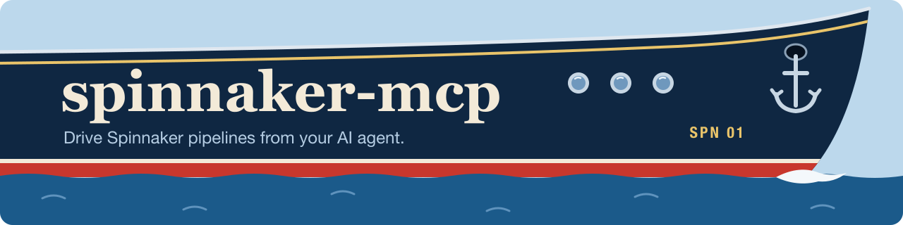
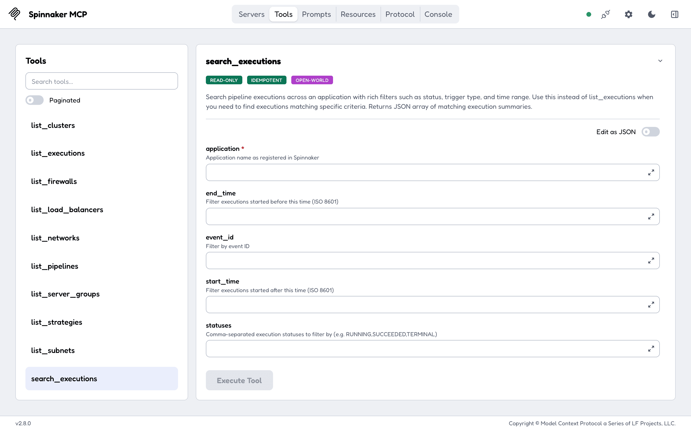
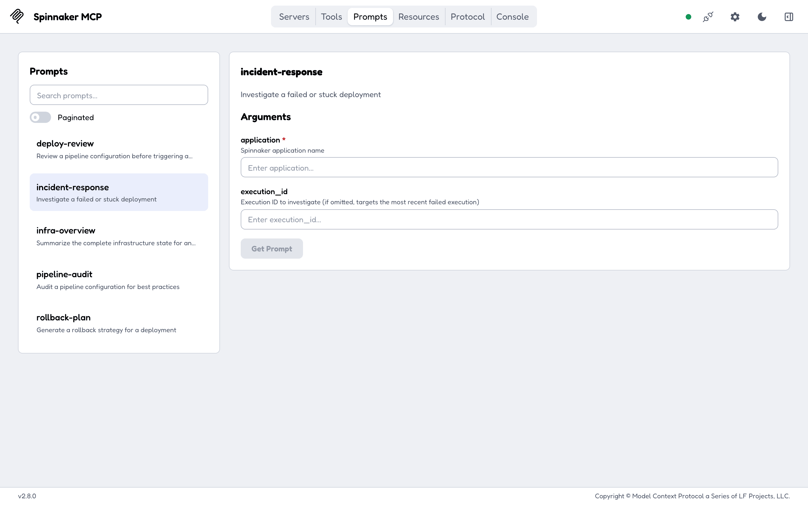
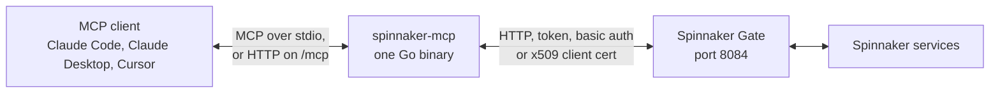

---
hide:
  - navigation
---

# spinnaker-mcp { .sm-visually-hidden }

  

  
  
  
  

---

**spinnaker-mcp** connects Claude, Cursor or any other MCP client to a [Spinnaker](https://spinnaker.io/) instance through its Gate API. Ask in plain words which executions of an application failed today and at which stage, what a stage returned, or what changed in a pipeline since its last revision; if you allow it, the assistant can also trigger, pause, resume or cancel the pipeline. Without it, the same answers mean opening each execution and stage in Deck, Spinnaker's UI, one at a time. It is one Go binary with 37 tools, 10 resources and 5 prompts, and it can start with only the 27 tools that read. Start with [Getting started](getting-started.md), then [Usage](usage.md) for everything the assistant can read and do.

-   :material-download: **[Getting started](getting-started.md)**

    ---

    npm, Docker, Helm or a local build, and what each needs from your Gate.

-   :material-connection: **[Connect your client](getting-started.md#claude-code-claude-desktop-configuration)**

    ---

    The `mcpServers` block for Claude Code, Claude Desktop and Cursor, with your Gate URL and token.

-   :material-chat-question-outline: **[Usage](usage.md)**

    ---

    The 37 tools, which of them change Spinnaker, the 10 resources and the 5 prompts.

-   :material-format-list-bulleted: **[Configuration](configuration.md)**

    ---

    Every environment variable with its default, the toolsets, and the HTTP endpoints.

## What the assistant sees

Started with `TOOLSETS=readonly`, the client is offered 27 tools and none of them can change Spinnaker. The resources give it the applications and accounts to start from (`spinnaker://applications`, `spinnaker://application/{name}/executions`), and the tools go deeper: an execution's stages and outputs, a cluster's server groups, an instance's console output. The full list is on [Usage](usage.md).

The five prompts are ready-made requests a client can offer as commands: review a pipeline before it runs, investigate a failed execution, audit a pipeline, summarise an application's infrastructure, and plan a rollback.

## Read versus act

- 27 tools only read. `evaluate_expression` sends a SpEL expression to Gate in a POST and changes nothing; it is marked read-only too.
- 10 tools change Spinnaker: `trigger_pipeline`, `save_pipeline`, `update_pipeline`, `delete_pipeline`, `cancel_execution`, `pause_execution`, `resume_execution`, `restart_stage`, `save_strategy` and `delete_strategy`. The two deletes are marked destructive, so a client that reads MCP tool annotations can ask before them.
- `TOOLSETS=readonly` (or `--toolsets=readonly`) registers only the 27. Groups such as `pipelines,executions` pick tools by area instead. See [Toolsets](configuration.md#toolsets).
- The resources and prompts are always registered. Resources only read; a prompt returns text and calls nothing by itself.

## How it runs

- Over stdio the client starts the binary itself. `npx -y spinnaker-mcp` downloads the binary for your platform and runs it that way, and the Docker image defaults to stdio too.
- Over HTTP the binary serves `/mcp`, `/healthz` and `/readyz` on `127.0.0.1:8085`. The Helm chart runs it this way in a pod. See [HTTP transport](configuration.md#http-transport).
- Every call runs as the Gate identity you configure: a bearer token first, then basic auth, then an x509 client certificate. Spinnaker's own access rules apply to that identity.
- Binaries for Linux, macOS and Windows on amd64 and arm64, the npm package `spinnaker-mcp`, the Docker image `drumsergio/spinnaker-mcp` and a Helm chart in the repository, all at one version. Install paths are on [Getting started](getting-started.md).

## What it does not do

- The HTTP endpoint has no login of its own. Whoever reaches `/mcp` acts with the Gate credentials the server holds. It listens on `127.0.0.1` unless you change `MCP_BIND_ADDR`; the Helm chart listens on `0.0.0.0` inside the pod, so limit who reaches the Service or run it read-only.
- It does not add permissions. It can do what its Gate identity can do in Spinnaker, and nothing more.
- It does not cover all of Gate. The 37 tools are the pipeline, execution, strategy and infrastructure calls; what comes next is on the [roadmap](https://github.com/GeiserX/spinnaker-mcp/blob/main/ROADMAP.md).
- It stores nothing. There is no database and no cache; every tool reads Gate when it is called.

## Getting help

- `/readyz` answers 503 with `"gate_reachable": false`: the server cannot reach `GATE_URL`. A 200 only proves Gate answered; a wrong token still passes it. See [HTTP transport](configuration.md#http-transport).
- The server exits at start with `Invalid toolsets`: `all`, `readonly` or `mutating` was combined with another value. See [Toolsets](configuration.md#toolsets).
- Something else: open an [issue](https://github.com/GeiserX/spinnaker-mcp/issues) with the server's log lines. A security problem goes through the [security policy](https://github.com/GeiserX/spinnaker-mcp/blob/main/SECURITY.md), never a public issue.
- Running the tests and trying the server in MCP Inspector: [Development](development.md). The other MCP servers in the family and where this one is listed: [Related projects](related.md).

## License

spinnaker-mcp is released under the [GPL-3.0-or-later](https://github.com/GeiserX/spinnaker-mcp/blob/main/LICENSE) license. It is built on [mcp-go](https://github.com/mark3labs/mcp-go).
